# Emotion Detection AI

Real-time emotion detection using YOLOv8.2 and Django.  
**Part of our 2024 graduation thesis.**

© 2024 Seda Yalçin & Alaz Ekici. All rights reserved.  
This project was developed as part of the Software Engineering undergraduate thesis at FMV Işık University.

---

## Thesis Poster

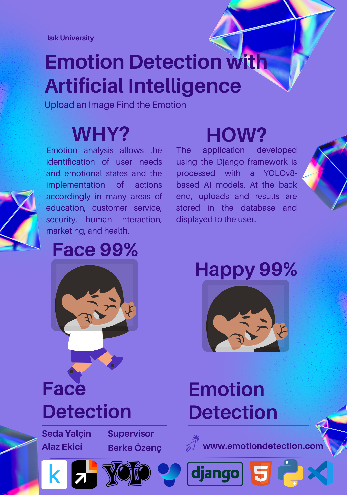

*Or download the poster [here](emotion-detection-with-ai.pdf).*

---

## About

This project detects 8 different emotions from facial images  
using a custom-trained YOLOv8 model and displays them via a Django web interface.

---

## Features
- Detects 8 emotion classes
- Real-time detection
- Web-based interface

---

## Datasets

We trained our emotion detection model using various datasets, ensuring a broad and thorough collection of photos.

- Grayscale Face Images: [Dataset Link](https://www.kaggle.com/datasets/geolek/grayscale-face-images)  
- MMA Facial Expression: [Dataset Link](https://www.kaggle.com/datasets/mahmoudima/mma-facial-expression?resource=download)  
- Facial Expression Dataset: [Dataset Link](https://www.kaggle.com/datasets/aadityasinghal/facial-expression-dataset?resource=download)  
- Random Images for Face Emotion Recognition: [Dataset Link](https://www.kaggle.com/datasets/sudarshanvaidya/random-images-for-face-emotion-recognition)  
- AffectNet Training Data: [Dataset Link](https://www.kaggle.com/datasets/noamsegal/affectnet-training-data?select=labels.csv)  

Because of variations in emotion categorization among these datasets, we relabeled the photos using the CVAT program.  
This step ensured that each image appropriately expressed the required sentiment.

---
## Dataset Summary
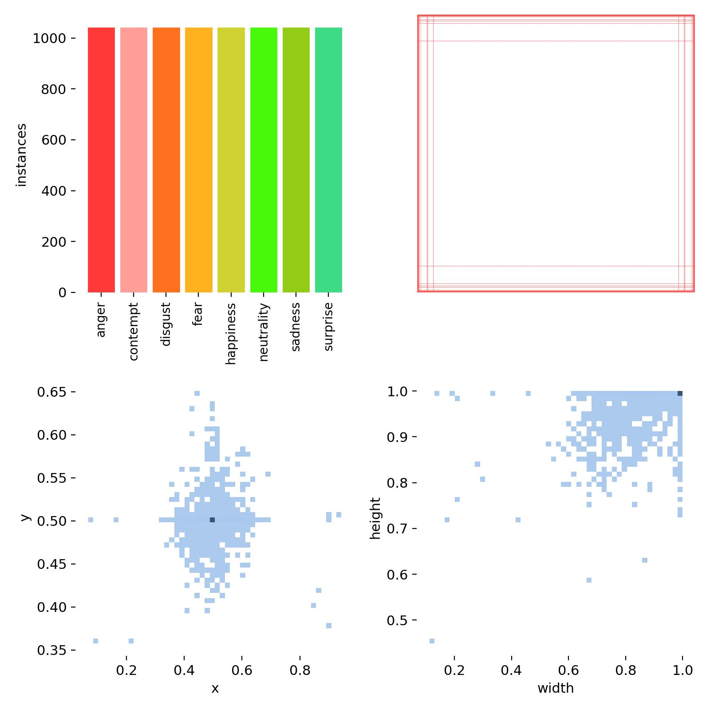
Each emotion class contains **1040 images**,  
resulting in a total of **8320 labeled images** used to train our AI model.

---

## Emotion Labels

The model predicts the following 8 emotion classes:

- 0: anger
- 1: contempt
- 2: disgust
- 3: fear
- 4: happiness
- 5: neutrality
- 6: sadness
- 7: surprise

---

## Model
The trained `.pt` model file is included.

---

## Model Details

- `yolov8n-emo.pt`: Custom-trained YOLOv8 model for emotion detection (trained by us)
- `yolov8n-face.pt`: Face detection model **sourced from [akanametov/yolov8-face](https://github.com/akanametov/yolov8-face)**

We only used the face detection part; all emotion classification work was done by us.

---

## Model Evaluation

To evaluate the performance of our artificial intelligence models, we used appropriate metrics such as **mAP, precision, recall, and loss**.  
These metrics help us measure the effectiveness of our solutions.

The graph below shows the training results of our AI model:

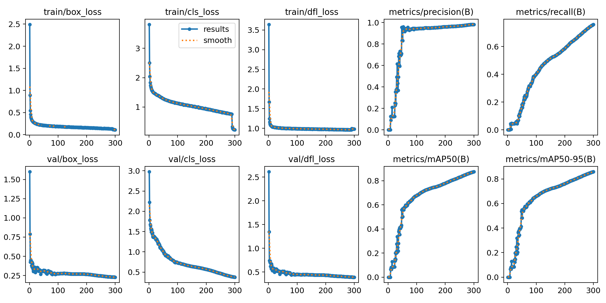

---

## Training Parameters

The training parameters we utilized were as follows:

- Task: detect  
- Mode: train  
- Model: yolov8n.yaml  
- Data: ./label56.yaml  
- Epochs: 300  
- Batch Size: 16  
- Image Size: 640  
- Optimizer: auto  
- Learning Rate: 0.01  
- Validation: enabled  
- Confidence Threshold: 0.8  
- IoU Threshold: 0.7  
- Augmentation: enabled  
- Label Smoothing: 0.0  
- Other parameters: Default values from the YOLOv8 framework

---

## Sample Result

The image below shows an example prediction by our emotion detection AI model:

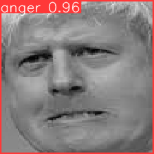
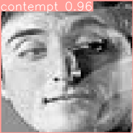
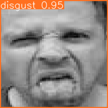
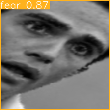
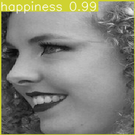
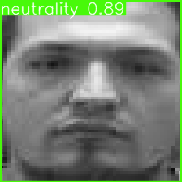
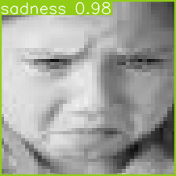
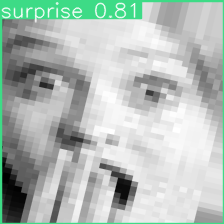

---

## How to Use
- Clone this repository
- Install required packages: `pip install -r requirements.txt`
- Run the Django server
- Upload an image for detection

---

## License

This project is licensed under the **Creative Commons Attribution-NonCommercial 4.0 International (CC BY-NC 4.0)** license.

You may use, share, and modify this project for non-commercial purposes, **provided that you give appropriate credit** to:

- Seda Yalçin
- Alaz Ekici

**Full license text:** https://creativecommons.org/licenses/by-nc/4.0/

